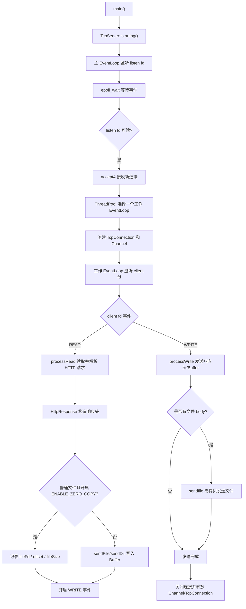

# ReactorHttp-CPP

一个基于 Reactor 模型实现的 C++ HTTP 静态资源服务器，支持非阻塞 IO、多路复用、线程池、HTTP 请求解析、目录/文件访问，并可通过宏开关切换普通文件的发送方式：原始 `read -> Buffer -> send` 流程或 `sendfile` 零拷贝流程。

## 项目特点

- 基于 Reactor 模型组织网络事件
- 支持 `epoll`，并保留 `poll` / `select` 调度器封装
- 监听 socket 和客户端 socket 均使用非阻塞模式
- 主线程负责 `accept`，工作线程负责连接读写和 HTTP 处理
- 封装 `EventLoop`、`Channel`、`Dispatcher`、`Buffer`
- 支持 HTTP GET 请求解析
- 支持静态文件访问和目录列表生成
- 普通文件可使用 `sendfile` 实现零拷贝发送
- 通过 `ENABLE_ZERO_COPY` 宏切换零拷贝/原始发送流程

## 目录结构

```text
ReactorHttp-CPP/
  Buffer.*           读写缓冲区
  Channel.*          fd、事件和回调封装
  Dispatcher.*       多路复用抽象基类
  EpollDispatcher.*  epoll 实现
  PollDispatcher.*   poll 实现
  SelectDispatcher.* select 实现
  EventLoop.*        事件循环和任务队列
  TcpServer.*        监听 socket、accept、新连接分发
  TcpConnection.*    客户端连接读写、响应发送
  HttpRequest.*      HTTP 请求解析和资源定位
  HttpResponse.*     HTTP 响应头构造和 body 类型记录
  ThreadPool.*       工作线程池
  WorkThread.*       工作线程和子 EventLoop
  Config.h           功能宏配置
  main.cpp           程序入口
```

## Reactor 流程



## 零拷贝开关

在 `Config.h` 中控制：

```cpp
#define ENABLE_ZERO_COPY
```

开启后：

```text
普通文件：
HttpRequest 只记录文件名和文件大小
HttpResponse 只构造响应头
TcpConnection::processWrite 先发送响应头，再使用 sendfile 发送文件内容
```

关闭后：

```cpp
//#define ENABLE_ZERO_COPY
```

普通文件回到原始流程：

```text
HttpRequest::sendFile
  -> read 文件到临时 buf
  -> appendString 写入 m_writeBuf
  -> TcpConnection::processWrite 使用 send 发送 Buffer
```

## 编译与运行

项目使用 Visual Studio Linux 远程构建配置，生成目标为 Linux 可执行文件。

运行方式：

```bash
./ReactorHttp-CPP.out <port> <web_root>
```

示例：

```bash
./ReactorHttp-CPP.out 10000 /home/user/www
```

浏览器访问：

```text
http://服务器IP:10000/
```

## 核心模块说明

### EventLoop

`EventLoop` 是事件循环核心，负责：

- 调用 Dispatcher 等待 IO 事件
- 根据 fd 查找对应 Channel
- 触发读/写回调
- 处理跨线程投递过来的 Channel 添加、删除、修改任务

### Channel

`Channel` 封装一个 fd 关注的事件和对应回调：

- READ_EVENT
- WRITE_EVENT
- readCallback
- writeCallback
- destroyCallback

### TcpServer

`TcpServer` 负责：

- 创建监听 socket
- 设置非阻塞
- 绑定和监听端口
- 在主 EventLoop 中处理 accept
- 将新连接分配给工作线程 EventLoop

### TcpConnection

`TcpConnection` 负责单个客户端连接：

- 从 socket 读取请求数据
- 调用 HttpRequest 解析 HTTP 请求
- 调用 HttpResponse 构造响应
- 写回响应头、目录页、错误页
- 开启零拷贝时使用 `sendfile` 发送普通文件

### Buffer

`Buffer` 封装读写缓冲区：

- 使用 `readv` 读取 socket 数据
- 使用 `send` 发送缓冲区数据
- 支持自动扩容
- 支持查找 HTTP 行结束符 `\r\n`

## 当前边界

当前项目适合作为学习型/实习项目展示，但还不是完整生产级 HTTP 服务器：

- 暂未实现 keep-alive
- 暂未实现 Range 请求，音视频拖动时浏览器可能主动断开旧连接
- 暂未实现连接空闲超时定时器
- HTTP 请求体处理较简化
- 路径安全检查为基础版本

## 可继续优化方向

- 增加 timerfd 定时器，关闭长时间空闲连接
- 支持 HTTP Range 请求，改善音频/视频播放体验
- 增加压测结果和性能对比
- 使用 RAII 管理连接私有资源
- 增加更完整的错误处理和日志

